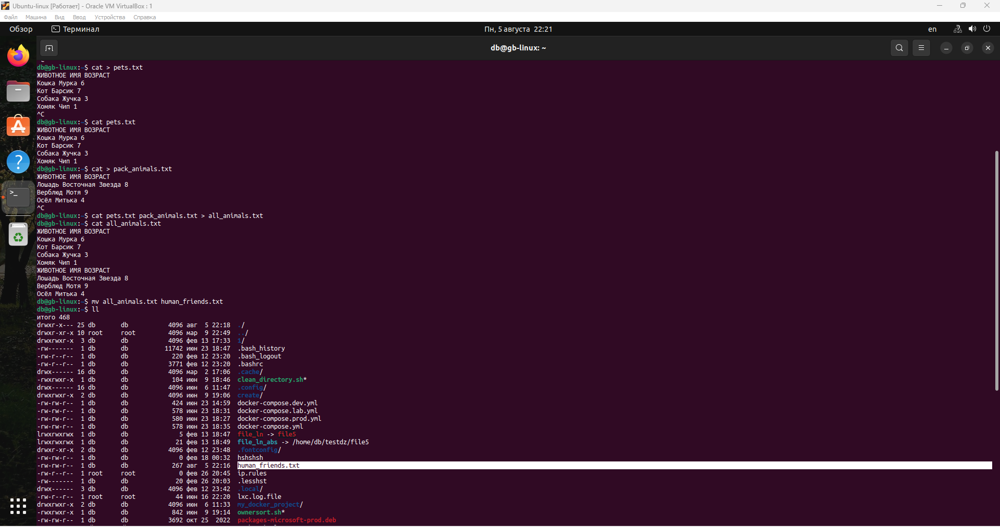
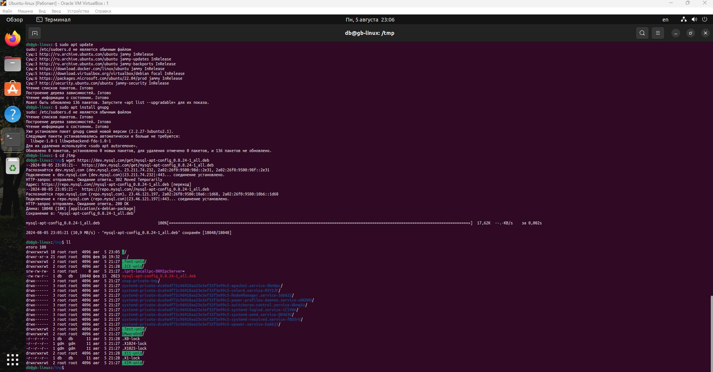
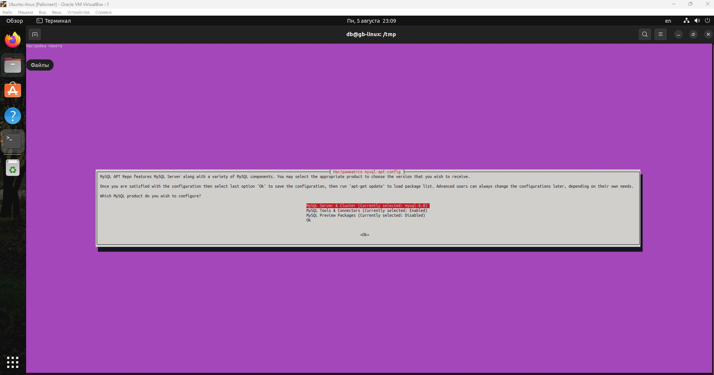
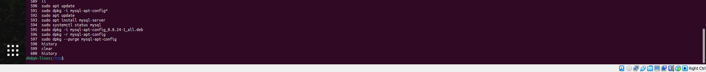
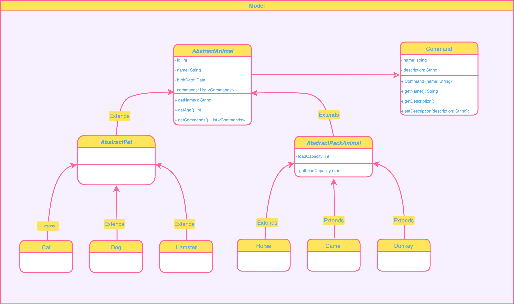

# Итоговая контрольная работа

## Информация о проекте

Необходимо организовать систему учета для питомника, в котором живут домашние и вьючные животные.

## Как сдавать проект

Для сдачи проекта необходимо создать отдельный общедоступный репозиторий (GitHub, GitLab или Bitbucket). Разработку вести в этом репозитории, использовать пул реквесты на изменения. Программа должна запускаться и работать, ошибок при выполнении программы быть не должно. Программа может использоваться в различных системах, поэтому необходимо разработать класс в виде конструктора.

## Задание

1. **Используя команду `cat` в терминале операционной системы Linux:**
    - Создать два файла: `Домашние животные` (заполнив файл собаками, кошками, хомяками) и `Вьючные животные` (заполнив файл лошадьми, верблюдами и ослами).
    - Объединить их и просмотреть содержимое созданного файла.
    - Переименовать файл, дав ему новое имя (`Друзья человека`).
2. **Создать директорию и переместить файл туда.**
3. **Подключить дополнительный репозиторий MySQL. Установить любой пакет из этого репозитория.**
4. **Установить и удалить deb-пакет с помощью `dpkg`.**
5. **Выложить историю команд в терминале Ubuntu.**
6. **Нарисовать диаграмму, в которой есть:**
    - Родительский класс
    - Классы: домашние животные и вьючные животные
    - В классы домашних животных войдут: собаки, кошки, хомяки
    - В классы вьючных животных войдут: лошади, верблюды и ослы
7. **В подключенном MySQL репозитории создать базу данных `Друзья человека`.**
8. **Создать таблицы с иерархией из диаграммы в БД.**
9. **Заполнить низкоуровневые таблицы именами животных, командами, которые они выполняют, и датами рождения.**
10. **Удалить из таблицы верблюдов (т.к. верблюдов решили перевезти в другой питомник на зимовку).**
    - Объединить таблицы лошадей и ослов в одну таблицу.
11. **Создать новую таблицу `молодые животные`, в которую попадут все животные старше 1 года, но младше 3 лет.**
    - В отдельном столбце с точностью до месяца подсчитать возраст животных в новой таблице.
12. **Объединить все таблицы в одну, при этом сохраняя поля, указывающие на прошлую принадлежность к старым таблицам.**
13. **Создать класс с инкапсуляцией методов и наследованием по диаграмме.**
14. **Написать программу, имитирующую работу реестра домашних животных. В программе должен быть реализован следующий функционал:**
    - Завести новое животное
    - Определять животное в правильный класс
    - Увидеть список команд, которые выполняет животное
    - Обучить животное новым командам
    - Реализовать навигацию по меню
15. **Создать класс `Счетчик`, у которого есть метод `add()`, увеличивающий значение внутренней int переменной на 1 при нажатии "Завести новое животное".**
    - Сделайте так, чтобы с объектом такого типа можно было работать в блоке try-with-resources.
    - Нужно бросить исключение, если работа с объектом типа счетчик была не в ресурсном try и/или ресурс остался открыт.
    - Значение считать в ресурсе try, если при заведении животного заполнены все поля.


                                          Ход работы:
## Организовать систему учета для питомника, в котором живут домашние и вьючные животные.
1. **Используя команду `cat` в терминале операционной системы Linux, создать два файла Домашние животные (заполнив файл собаками, кошками, хомяками) и Вьючными животными (заполнив файл лошадьми, верблюдами и ослами), а затем объеденить их.**

          cat > pets.txt
          cat > pack_animals.txt
          cat pets.txt pack_animals.txt > all_animals.txt

    Просмотреть содержимое созданного файла. Переименовать файл, дав ему новое имя (Друзья человека).

            cat all_animals.txt
            mv all_animals.txt human_friends.txt



2. **Создать директорию и перемстить файл туда.**

            mkdir animals
            mv human_friends.txt animals


3. **Подключить доплнительный репозиторий MySQL. Установить любой пакет из этого репозитория**

            sudo apt update
            sudo apt install gnupg
            cd /tmp
            wget https://dev.mysql.com/get/mysql-apt-config_0.8.24-1_all.deb
            ll
            sudo dpkg -i mysql-apt-config*
            sudo apt update
            sudo apt install mysql-server
            sudo systemctl status mysql






4. **Установить и удалить deb-пакет с помощью dpkg.**

            sudo dpkg -i mysql-apt-config_0.8.24-1_all.deb
            sudo dpkg -r mysql-apt-config
            sudo dpkg --purge mysql-apt-config


5. **Выложить историю команд в терминале ubuntu.**

            history



6. **Нарисовать диаграмму, в которой есть класс родительский класс, домашние животные и вьючные животные, в составы которых в случае домашних животных войдут классы: собаки, кошки, хомяки, а в класс вьючные животные войдут: лошади, верблюды и ослы.**



7. **В подключенном MySQL репозитории создать базу данных “Друзья человека”.**

#### Скрипт базы данных human_friends -> [Script BD human_friends](files/human_friends_db_script.sql "Здесь можно посмотреть скрипт создания и наполнения базы данных human_friends")
   #### Схема базы данных human_friends
   

```sql
DROP DATABASE IF EXISTS human_friends;
CREATE DATABASE human_friends;
USE human_friends;
```

8. Создать таблицы с иерархией из диаграммы в БД
```sql
DROP TABLE IF EXISTS commands;
CREATE TABLE commands
(
    id INT PRIMARY KEY NOT NULL AUTO_INCREMENT,
    name varchar(30),
    description varchar(255)
);

DROP TABLE IF EXISTS animals_group;
CREATE TABLE animals_group
(
    id INT PRIMARY KEY NOT NULL AUTO_INCREMENT,
    name varchar(30)
);

DROP TABLE IF EXISTS animal_genius;
CREATE TABLE animal_genius
(
    id INT PRIMARY KEY NOT NULL AUTO_INCREMENT,
    name varchar(30),
    group_id INT,
    FOREIGN KEY (group_id) REFERENCES animals_group (id)
    ON DELETE CASCADE ON UPDATE CASCADE
);

DROP TABLE IF EXISTS nursery_animal;
CREATE TABLE nursery_animal
(
    id INT PRIMARY KEY NOT NULL AUTO_INCREMENT,
    name varchar(30),
    birth_date DATE,
    genius_id INT,
    FOREIGN KEY (genius_id) REFERENCES animal_genius (id)
    ON DELETE CASCADE ON UPDATE CASCADE
);

DROP TABLE IF EXISTS animal_commands;
CREATE TABLE animal_commands
(
    animal_id INT NOT NULL,
    command_id INT NOT NULL,

    PRIMARY KEY (animal_id, command_id),
    FOREIGN KEY (animal_id) REFERENCES nursery_animal (id)
     ON DELETE CASCADE ON UPDATE CASCADE,
    FOREIGN KEY (command_id) REFERENCES commands (id)
     ON DELETE CASCADE  ON UPDATE CASCADE
);
```

9. Заполнить низкоуровневые таблицы именами(животных), командами которые они выполняют и датами рождения
```sql
INSERT INTO commands(name)
VALUES
	 ('Поймать мышь'),
	 ('Сальто'),
	 ('Прыжок'),
	 ('Лечебный Ур-Ур-Ур'),
	 ('Плеваться далеко');

INSERT INTO animals_group (name)
VALUES
	 ('Вьючные животные'),
	 ('Домашние животные');

INSERT INTO animal_genius (name, group_id)
VALUES
	 ('Кошка', 2),
	 ('Собака', 2),
	 ('Хомяк', 2),
	 ('Лошадь', 1),
	 ('Осел', 1),
	 ('Верблюд', 1);

INSERT INTO nursery_animal (name, birth_date, genius_id)
VALUES
	 ('Герда', '2022-05-20', 1),
	 ('Мильва', '2022-12-01', 2),
	 ('Плотва', '2022-07-12', 4),
	 ('Осел', '2021-02-04', 5),
	 ('Сухарик', '2023-01-24', 6),
	 ('Хома', '2022-12-20', 3),
	 ('Матрона', '2020-08-24', 1);

INSERT INTO animal_commands (animal_id, command_id)
VALUES
	 (1, 1), (1, 4), (2, 1), (2, 4),
	 (3, 3), (4, 3), (5, 5), (6, 2),
	 (7, 1), (7, 4);
```

10. Удалить из таблицы верблюдов, т.к. верблюдов решили перевезти в другой питомник на зимовку. Объединить таблицы лошади, и ослы в одну таблицу.
```sql
DELETE FROM nursery_animal WHERE genius_id = 5;

CREATE TABLE horse_donkey AS
SELECT * from nursery_animal WHERE genius_id = 4
UNION
SELECT * from nursery_animal WHERE genius_id = 5;
```

11. Создать новую таблицу “молодые животные” в которую попадут все животные старше 1 года, но младше 3 лет и в отдельном столбце с точностью до месяца подсчитать возраст животных в новой таблице
```sql  
CREATE TABLE young_animals AS
SELECT id, name, birth_date, 
datediff(curdate(),birth_date) DIV 31 as age, genius_id 
from nursery_animal 
WHERE date_add(birth_date, INTERVAL 1 YEAR) < curdate() 
AND date_add(birth_date, INTERVAL 3 YEAR) > curdate();
```
           
12. Объединить все таблицы в одну, при этом сохраняя поля, указывающие на прошлую принадлежность к старым таблицам.
```sql
SELECT id, name, birth_date, genius_id FROM horse_donkey
UNION
SELECT id, name, birth_date, genius_id FROM young_animals;
```